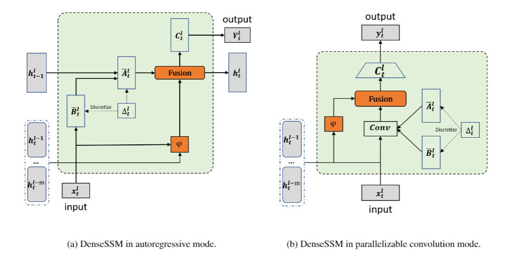
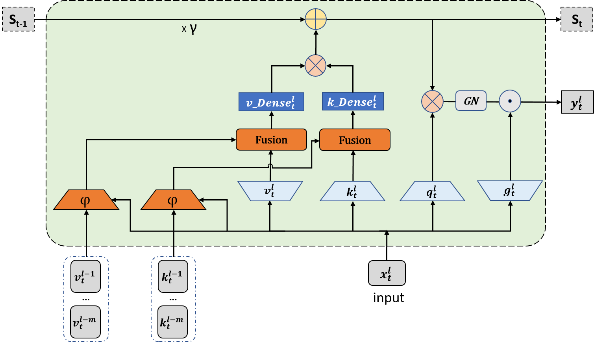
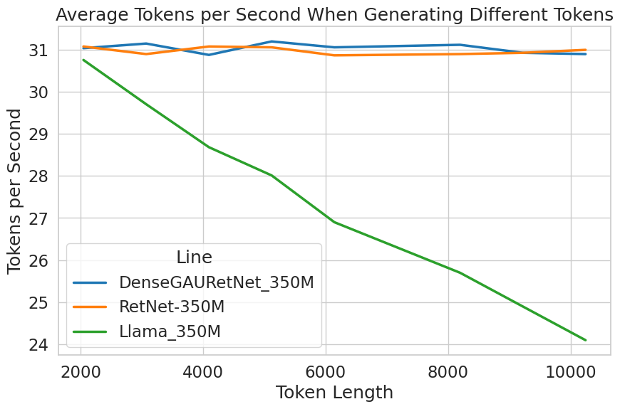

# DenseSSM
This is a PyTorch implementation of DenseRetNet, as described in the paper [DenseMamba: State Space Models with Dense Hidden Connections for Efficient Large Language Models](https://arxiv.org/abs/2403.00818).

## Overview
Large language models (LLMs) face a daunting challenge due to the excessive computational and memory requirements of the commonly used Transformer architecture. While state space model (SSM) is a new type of foundational network architecture offering lower computational complexity, their performance has yet to fully rival that of Transformers. This paper introduces DenseSSM, a novel approach to enhance the flow of hidden information between layers in SSMs. By selectively integrating shallow-layer hidden states into deeper layers, DenseSSM retains fine-grained information crucial for the final output. Dense connections enhanced DenseSSM still maintains the training parallelizability and inference efficiency. The proposed method can be widely applicable to various SSM types like RetNet and Mamba. With similar model size, DenseSSM achieves significant improvements, exemplified by DenseRetNet outperforming the original RetNet with up to 5\% accuracy improvement on public benchmarks.
## DenseMamba
[](./assets/densemamba.png)

## DenseRetNet
[](./assets/linear_dense_gau_recurrence.png)


## How to run
### Training datasets
The paper uses a subset of 15B tokens of The Pile Dataset (https://pile.eleuther.ai/) for training.

### Requirements
To run our code, first install requirements:
```bash
pip install -r requirements.txt
```
### Command
For example,if you want to pretrain the dense_gau_retnet_350m model on a single gpu, you can run:

```bash
python -m torch.distributed.launch --use_env --nproc_per_node 1 --nnodes 1 --node_rank 0 --master_addr=<your_random_port> train.py \
  --model_name_or_path modeling/dense_gau_retnet_350m
  --dataset_dir <your_path_to_dataset>
  --data_cache_dir <your_path_to_data_cache_dataset>
  --validation_split_percentage 0.001
  --per_device_train_batch_size 2
  --per_device_eval_batch_size 1
  --do_train
  --seed 1995
  --lr_scheduler_type polynominal
  --learning_rate 6e-4
  --warmup_ratio 0.015
  --weight_decay 0.01
  --logging_strategy steps
  --save_strategy steps
  --save_steps 1000
  --save_total_limit 10
  --gradient_accumulation_steps 16 
  --preprocessing_num_workers 4
  --block_size 2048
  --output_dir <your_path_to_output_dir>
  --overwrite_output_dir
  --evaluation_strategy "no"
  --report_to tensorboard
  --logging_dir <your_path_to_tensorboard_dir>
  --logging_steps 1
  --model_max_length 2048
  --debug_mode False
  --fp16 True
  --ddp_find_unused_parameters True
  --adam_beta2 0.98
  --prediction_loss_only True
```

### Inference speed
Use inference_test.py to inference. This figure shows end-to-end generate speed of generating different tokens with batch_size=6.
[](./assets/speed.png)

# Future work
- [x] Training code for **DenseRetNet**
- [ ] Better inference code
- [ ] Chunk-wise Recurrence Mode
- [ ] Codes for DenseMamba


## Citation
```
@misc{he2024densemamba,
    title={DenseMamba: State Space Models with Dense Hidden Connection for Efficient Large Language Models},
    author={Wei He and Kai Han and Yehui Tang and Chengcheng Wang and Yujie Yang and Tianyu Guo and Yunhe Wang},
    year={2024},
    eprint={2403.00818},
    archivePrefix={arXiv},
    primaryClass={cs.CL}
}
```

### Acknowledgements

We would like to thank the following projects for their contributions to our work:

- The transformersscale project by Microsoft (https://github.com/microsoft/transformersscale/tree/main) for the official RetNet code.
- The RetNet repository (https://github.com/syncdoth/RetNet) for the huggingface compatible RetNet code.
- The LLaMA model implementation in the transformers library by Hugging Face (https://github.com/huggingface/transformers/blob/main/src/transformers/models/llama/modeling_llama.py), which we have modified for our purposes.
- The Chinese-LLaMA-Alpaca project (https://github.com/ymcui/Chinese-LLaMA-Alpaca) for training scripts.

